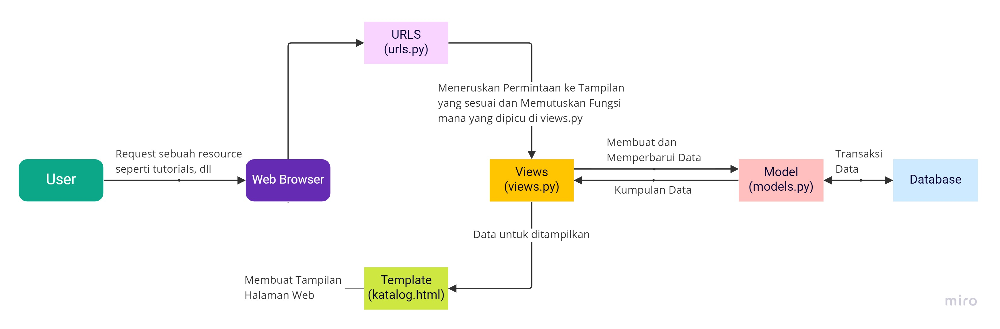

# Tugas 2 PBP - Nomor 5

Pemrograman Berbasis Platform (CSGE602022) - diselenggarakan oleh Fakultas Ilmu Komputer Universitas Indonesia, Semester Ganjil 2022/2023

## Bagan

**Buatlah bagan yang berisi request client ke web aplikasi berbasis Django beserta responnya dan jelaskan pada bagan tersebut kaitan antara urls.py, views.py, models.py, dan berkas html;**



## Virtual Environment

**Jelaskan kenapa menggunakan virtual environment? Apakah kita tetap dapat membuat aplikasi web berbasis Django tanpa menggunakan virtual environment?**

Virtual environment adalah sebuah wadah untuk menampung modul-modul dalam suatu proyek. Virtual environment biasanya digunakan untuk proyek yang berbasis python sehingga virtualenv ini digunakan sebagai tools yang berfungsi untuk membuat lingkungan python virtual yang tertutup dan tidak dapat diakses dari dunia luar (terisolasi). Virtual environment ini sangat dibutuhkan ketika kita ingin mengerjakan beberapa proyek dengan modul yang sama tetapi membutuhkan versi yang berbeda sehingga proyek yang sedang kita kerjakan tidak akan bentrok dengan proyek lain.

Kita dapat membuat aplikasi web berbasis Django dengan menggunakan virtual environment agar setiap kali kita membuat proyek baru, kita dapat memastikan bahwa versi dari sebuah library yang digunakan di satu proyek tidak akan berubah apabila kita melakukan sebuah update di library yang sama di proyek lainnya.

Selanjutnya, kita juga dapat membuat aplikasi web berbasis Django tanpa menggunakan virtual environment. Tetapi, ketika kita tidak mengaktifkan virtualenv, modul-modul di dalam proyek aplikasi web berbasis Django nantinya akan diambil dari global environment sehingga komputer hanya dapat menargetkan satu versi Django. Hal ini dapat menjadi masalah ketika kita ingin membuat aplikasi web baru dengan menggunakan versi terbaru Django, lalu kita ingin tetap mempertahankan aplikasi web yang telah kita buat sebelumnya dengan versi yang lebih lama. Kita tidak dapat melakukan hal seperti itu karena akan terjadi issue dependency yang akan menyebabkan antar proyek menjadi bentrok. Oleh karena itu, kita harus menggunakan virtual environment agar aplikasi web kita dapat memiliki modulnya sendiri sehingga kita dapat terhindar dari masalah-masalah di atas.

## Implementasi

**Jelaskan bagaimana cara kamu mengimplementasikan poin 1 sampai dengan 4 di atas.**

Sebelum mengimplementasikan poin 1 - 4, saya terlebih dahulu membuka GitHub repositori templat kode, lalu klik tombol "**Use this template**" untuk membuat salinan repositori ke dalam akun GitHub saya. Lalu, saya membuka laman GitHub repositori yang dibuat dari templat dan saya melakukan perintah `git clone` untuk menyalin repositorinya ke suatu lokasi di dalam sistem berkas (_filesystem_) komputer saya.

Kemudian, cara saya mengimplementasikan poin 1 sampai 4 dengan seperti ini:

1. Pada poin 1 ini, saya meng-import models yang sudah tersedia di template ke dalam views.py.

   ```shell
   from django.shortcuts import render
   from katalog.models import CatalogItem
   ```

2. Lalu, saya membuat sebuah fungsi bernama show_katalog yang menerima parameter request dan berisi potongan kode berikut:

   ```shell
   def show_katalog(request):
      data_barang_katalog = CatalogItem.objects.all()
      context = {
         'list_barang': data_barang_katalog,
         'nama': 'Hayfa Najma',
         'npm' : '2106653754'
      }
      return render(request, "katalog.html", context)
   ```

Potongan kode di atas berfungsi untuk memanggil fungsi query ke model database dan menyimpan hasil query tersebut ke dalam sebuah variabel yang telah saya buat. Kemudian, fungsi show_katalog akan mengembalikan return render(request, "katalog.html", context). Data yang ada pada variabel context tersebut akan ikut di-render oleh Django sehingga nantinya saya dapat memunculkan data tersebut pada halaman HTML.

3. Setelah membuat sebuah routing, saya melakukan pemetaan terhadap data yang telah ikut di-render pada fungsi yang terdapat di dalam views.py agar dapat memunculkannya di halaman HTML. Saat melakukan pemetaan, saya menggunakan sintaks khusus dari Django, yaitu {{data}}. Kemudian, saya pada bagian Fill me! yang ada di dalam HTML tag <p> seperti ini:


   ```shell
   <h5>Name: </h5>
   <p>Fill me!</p>
 
   <h5>Student ID: </h5>
   <p>Fill me!</p>
   ```
   
Saya ubah menjadi {{nama}} dan {{npm}} sesuai variabel “nama” dan “npm” yang telah saya buat sebelumnya di views.py. Kemudian, bagian Fill me! pada HTML akan berubah menjadi seperti ini:

   ```shell
   <h5>Name: </h5>
   <p>{{nama}}</p>
 
   <h5>Student ID: </h5>
   <p>{{npm}}</p>
   ```

Selanjutnya, saya melakukan iterasi terhadap variabel list_barang yang telah saya ikut render ke dalam HTML untuk menampilkan daftar barang ke dalam tabel. Variabel list_barang merupakan sebuah kontainer yang berisi objek sehingga saya tidak bisa memanggil daftar barang tersebut secara langsung. Oleh karena itu, saya mecoba untuk memanggil nama variabel/atribut spesifik dari objek yang ada di dalam kontainer tersebut untuk memanggil data dari objek tersebut. Berikut adalah potongan kodenya:

   ```shell
    Add the data below this line 
   
   <tr>
      <th>{{barang.item_name}}</th>
      <th>{{barang.item_price}}</th>
      <th>{{barang.item_stock}}</th>
      <th>{{barang.description}}</th>
      <th>{{barang.Rating}}</th>
      <th>{{barang.item_url}}</th>
   </tr>
   
   ```

Selanjutnya, saya akan mencoba untuk menjalankan proyek Django saya dengan cara:
   1. Nyalakan terlebih dahulu _virtual environment_ dengan perintah berikut:

      ```shell
      python -m venv env
      ```

   2. Lalu, saya menyalakan environment dengan perintah berikut:

      ```shell
      # Windows
      .\env\Scripts\activate
      ```

   3. Kemudian, saya menginstall dependencies yang dibutuhkan untuk menjalankan aplikasi dengan perintah berikut:

      ```shell
      pip install -r requirements.txt
      ```

   4. Lalu, saya menjalankan aplikasi Django menggunakan server pengembangan yang berjalan secara lokal:

      ```shell
      python manage.py runserver
      ```

   5. Selanjutnya, bukalah `http://localhost:8000` pada browser untuk melihat apakah aplikasi sudah berjalan dengan benar.

Apabila sudah muncul, maka saya sudah berhasil menyambungkan models dengan views dan template sekaligus mempelajari dasar dari sintaks template dari Django. Kemudian, saya melakukan add, commit, dan push pada cmd saya untuk melihat perubahan yang sudah saya lakukan dan menyimpannya ke dalam repositori GitHub yang telah saya buat.

4. Setelah saya melakukan add, commit, dan push pada cmd, saya membuka tab GitHub Actions di repositori saya dan terlihat bahwa workflow sudah berjalan namun berstatus gagal karena terjadi error yang mengatakan bahwa terdapat beberapa parameter dalam proses deployment yang tidak ditemukan. Hal itu terjadi karena saya belum mengonfigurasi parameter yang dibutuhkan oleh workflow. Oleh karena itu, saya akan melakukan konfigurasi terhadap paramater tersebut agar proses melakukan deploy aplikasi Django ke Heroku dapat berjalan dengan lancar sehingga dapat diakses oleh teman-teman saya melalui internet. Berikut ini langkah-langkah deployment yang saya lakukan, yaitu:
   1. Saya melakukan login ke akun Heroku, lalu saya membuat sebuah aplikasi Heroku bernama tugas2hayfa.
   2. Kemudian, saya menyalin API Key yang ada di Account Settings
   3. Lalu, saya membuka konfigurasi repositori GitHub saya dan membuka bagian Secrets untuk GitHub Actions (Settings -> Secrets -> Actions).
   4. Selanjutnya, saya menambahkan dua variabel repository secret baru untuk melakukan deployment. Variabel pertama berisi HEROKU_API_KEY dan variabel kedua berisi HEROKU_APP_NAME. Kemudian, simpan variabel-variabel tersebut.
   5. Lalu, saya membuka tab GitHub Actions dan menjalankan kembali workflow yang gagal.

Setelah itu, workflow yang dijalankan tadi akan berhasil dan status deployment menjadi centang hijau yang artinya sudah berhasil melakukan deployment ke Heroku. Sekarang, aplikasi Django yang telah saya buat sudah dapat diakses di internet melalui link berikut: https://tugas2hayfa.herokuapp.com/katalog/

## Referensi

- https://pbp-fasilkom-ui.github.io/ganjil-2023/assignments/tutorial/tutorial-0
- Belajar Django #1: Pengenalan Dasar Django Untuk Pemula. Petani Kode. (2016, August 24). Retrieved September 11, 2022, from https://www.petanikode.com/django-untuk-pemula/ 
- Mengenal Virtualenv: Apa Saja Yang Harus Kamu Ketahui? Petani Kode. (2017, August 23). Retrieved September 11, 2022, from https://www.petanikode.com/python-virtualenv/ 
- Alifian Adexe. (2020, December 18). Belajar Tentang Virtual environtment pada python. AnbiDev. Retrieved September 11, 2022, from https://www.anbidev.com/python-virtual-environtment/ 
- Django interview questions? Blog. (n.d.). Retrieved September 11, 2022, from https://www.dothedev.com/blog/2020/09/15/django-interview-questions-python-django-interview-question/ 